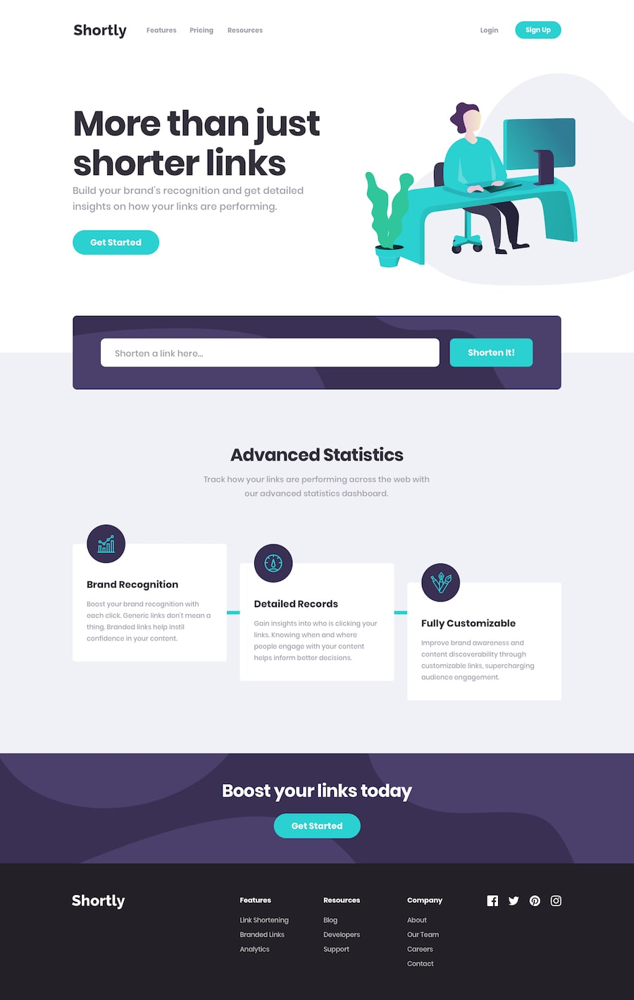

# Frontend Mentor - URL Shortening API landing page solution

This is a solution to the [URL shortening api landing page challenge](https://www.frontendmentor.io/challenges/url-shortening-api-landing-page-2ce3ob-G). Frontend Mentor challenges help you improve your coding skills by building realistic projects.

## Table of contents

- [Frontend Mentor - URL Shortening API landing page solution](#frontend-mentor---url-shortening-api-landing-page-solution)
  - [Table of contents](#table-of-contents)
  - [Overview](#overview)
    - [Screenshot](#screenshot)
    - [Links](#links)
  - [My process](#my-process)
    - [Built with](#built-with)
    - [What I learned](#what-i-learned)
    - [Continued development](#continued-development)
    - [Useful resources](#useful-resources)
  - [Author](#author)
  - [License](#license)

## Overview

### Screenshot

**TODO**

### Links

- Live Site URL: **TODO**

## My process

### Built with

**TODO**

### What I learned

**TODO**

### Continued development

**TODO**

### Useful resources

- [Find Nearest Tailwind Colour](https://find-nearest-tailwind-colour.netlify.app/) - Useful to find the nearest Tailwind colour that matches the given specs.
- [HSLtoRGB](https://colordesigner.io/convert/hsltorgb)

## Author

- Frontend Mentor - [@gowikel](https://www.frontendmentor.io/profile/gowikel)
- Linkedin - [@gowikel](https://www.linkedin.com/in/gowikel/)

## License

This project is licensed under the Unlicense, a public domain equivalent license that allows you to freely use, modify, distribute, and do whatever you want with the project's code, with no restrictions.

However, it's important to note that the code within `assets/frontendmentor` is licensed by [Frontend Mentor](https://www.frontendmentor.io/) and requires their explicit permission for use, not falling under the Unlicense. They are included in this repository for convenience, but careful steps have been taken to prevent their display or distribution.
